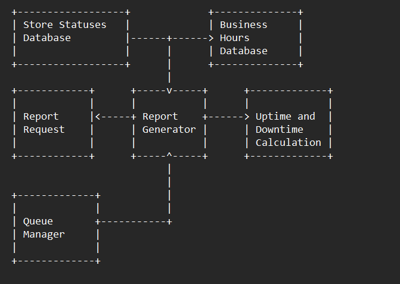

# Store Uptime Downtime API

## Steps to Run

1. create vitual enviroment
    python -m venv ./venv
    ./venc/Scripts/activate
2. Install dependencies from requirements.txt
    pip install -r requirements.txt
3. Import Data(keep in mind of csv file names check import_data.py)
    python import_data.py 
4. Run the API
    uvicorn main:app --host 127.0.0.1 --port 8000

# Store Uptime Downtime API

  

## Steps to Run

  

1. create vitual enviroment

    python -m venv ./venv

    ./venc/Scripts/activate

2. Install dependencies from requirements.txt

    pip install -r requirements.txt

3. Run the API

    uvicorn main:app --host 127.0.0.1 --port 8000

  

## Documentation

### Overview

This application is an API designed to generate and retrieve store uptime and downtime reports based on store data. The application is built using FastAPI and relies on SQLAlchemy to handle the database operations.

  

### Structure

The application is organized into four main modules:

  

1.  `main.py`: Defines the FastAPI application and includes the router from the report.py module.

2.  `database.py`: Contains the database model classes and creates the SQLite database.

3.  `report.py`: Handles the API routes for triggering and retrieving the generated reports.

4.  `report_generation.py`: Manages the report generation process.

#### main.py

This module defines the FastAPI application and includes the report_router from the report.py module. The application contains a single default route, which returns a "Hello World" message when accessed.

  

#### database.py

This module defines the database model classes and creates an SQLite database using SQLAlchemy. The database contains three tables:

  

`stores`: Stores information about individual stores, including their ID and timezone.

`store_statuses`: Holds store status data, such as the store ID, timestamp (in UTC), and the store status (active or inactive).

`store_business_hours`: Contains information about the store's business hours, including the store ID, day of the week, and the start and end times of the business hours.

Indexes are added to the store_id columns of store_statuses and store_business_hours tables to speed up filtering operations.

  

#### report.py

This module defines the API routes for triggering and retrieving store uptime and downtime reports. The API includes two routes:

  

 1. `POST /report/trigger_report`: Triggers the generation of a new
    report, assigns it a UUID, and adds the report to the queue for
    processing. The route returns the assigned UUID to the user.
    
 2. `GET /report/get_report/{report_id}`: Retrieves the generated report
        with the specified UUID. If the report is still being generated, the
        route returns a "Running" status; otherwise, it returns the
        completed report as a CSV file.

A queue processor function (queue_processor()) processes the report generation tasks in the background.

  

#### report_generation.py

This module is responsible for generating the store uptime and downtime reports. The generate_report() function is called when a new report is triggered. The function retrieves store data from the database and processes the data to calculate uptime and downtime for each store within the specified time intervals (last hour, last day, and last week). The report is then saved as a CSV file.

  

To efficiently process store data, the generate_report() function uses a ThreadPoolExecutor to parallelize the processing of individual stores. A progress bar is displayed using tqdm to provide feedback on the progress of the report generation.

  

The calculate_uptime_downtime() function calculates the uptime and downtime within business hours for each store. The function calls get_uptime_downtime() to find the uptime and downtime minutes for each store within the specified time range.

  

Usage

To use the API, follow these steps:

 1. Trigger a new report by sending a POST request to the
    /report/trigger_report route. The API will return a UUID as the
    report ID.
    
    
 2. To retrieve the generated report, send a GET request to the
        /report/get_report/{report_id} route, replacing {report_id} with the
        UUID returned in step 1. If the report is still being generated, the
        API will return a "Running" status; otherwise, it will return the
        completed report as a CSV file

.

The generated report will include uptime and downtime data for each store within the specified time intervals (last hour, last day, and last week). The CSV file will have the following columns:

-   `store_id`: The ID of the store.
-   `uptime_last_hour`: The uptime in minutes for the store within the last hour.
-   `downtime_last_hour`: The downtime in minutes for the store within the last hour.
-   `uptime_last_day`: The uptime in minutes for the store within the last day.
-   `downtime_last_day`: The downtime in minutes for the store within the last day.
-   `uptime_last_week`: The uptime in minutes for the store within the last week.
-   `downtime_last_week`: The downtime in minutes for the store within the last week.

## Example

Suppose you have deployed the API, and you would like to generate a new report and retrieve it. You can follow these steps:

1.  Use a tool like `curl`, Postman, or your favorite API client to send a `POST` request to the `/report/trigger_report` route:

    curl -X POST http://<API_URL>/report/trigger_report 

The API will respond with a JSON object containing the report ID:

    {
      "report_id": "f0a1b2c3-d4e5-6789-abcd-ef0123456789"
    } 

2.  To retrieve the generated report, send a `GET` request to the `/report/get_report/{report_id}` route, replacing `{report_id}` with the UUID returned in step 1:

  

    curl -X GET http://<API_URL>/report/get_report/f0a1b2c3-d4e5-6789-abcd-ef0123456789

If the report is still being generated, the API will return a JSON object with the status "Running":

    {
      "status": "Running"
    } 

Once the report is complete, the API will return a JSON object containing the status "Complete" and the CSV file content:

    {
      "status": "Complete",
      "csv_file": "store_id,uptime_last_hour,downtime_last_hour,uptime_last_day,downtime_last_day,uptime_last_week,downtime_last_week\n1,42,18,620,940,4500,2700\n2,60,0,1440,0,10080,0\n..."
    }

You can then parse the CSV data and analyze the uptime and downtime information for each store within the specified time intervals.

## Calculation Logic For Uptime and Downtime

The calculation of uptime and downtime is based on the following assumptions:

1.  A store's business hours are represented as intervals of time during which the store is open.
2.  A store's status can be either "active" (up) or "inactive" (down). Status changes are recorded with a timestamp in UTC.
3.  Uptime and downtime are calculated only within the store's business hours.

### Step 1: Define Time Intervals

The `calculate_uptime_downtime()` function starts by defining three time intervals for the report:

-   `last_hour`: The interval between one hour ago and the current time.
-   `last_day`: The interval between one day ago and the current time.
-   `last_week`: The interval between one week ago and the current time.

### Step 2: Calculate Uptime and Downtime

The `get_uptime_downtime()` function calculates the uptime and downtime within a specified time interval (e.g., last hour, last day, or last week) using the following steps:

1.  Initialize `uptime_minutes` and `downtime_minutes` counters to zero.
    
2.  Find the store's business hours by filtering the `store_business_hours` list based on the `store_id`.
    
3.  If the store does not have business hours data, assume it's open 24x7. In this case, create a `StoreBusinessHours` object with all days of the week and a time range of 00:00:00 to 23:59:59.
    
4.  Iterate through each day within the desired time interval, and for each day, check if the current day is within the store's business hours.
    
5.  If the current day is within the store's business hours, convert the start and end times of the business hours to datetime objects in the local timezone.
    
6.  Clip the business hours to the desired time interval. This means that if the start time of the business hours is before the start time of the interval, set the start time to the start time of the interval. Similarly, if the end time of the business hours is after the end time of the interval, set the end time to the end time of the interval.
    
7.  Find the last status observation before the start of the clipped business hours. Initialize `previous_status` to this value and set `previous_timestamp` to the start of the clipped business hours.
    
8.  Iterate through the store statuses that fall within the clipped business hours. For each status:
    
    a. Calculate the difference in minutes between the status timestamp and the `previous_timestamp`. Let's call this `delta_minutes`.
    
    b. If the `previous_status` is "active", add `delta_minutes` to the `uptime_minutes`. If the `previous_status` is "inactivec. Update the `previous_status` to the current status and set `previous_timestamp` to the current status timestamp.

9.  After iterating through all the store statuses within the clipped business hours, there might be some remaining time after the last status observation. Calculate the difference in minutes between the end of the clipped business hours and the `previous_timestamp`. Let's call this `delta_minutes`.
    
10.  If the `previous_status` is "active", add `delta_minutes` to the `uptime_minutes`. If the `previous_status` is "inactive", add `delta_minutes` to the `downtime_minutes`.
    
11.  Repeat steps 4 to 10 for each day within the desired time interval.
    
12.  Once the iteration is complete, the `uptime_minutes` and `downtime_minutes` counters will hold the total uptime and downtime, respectively, within the store's business hours for the specified time interval.

## System Design

1.  **Store Statuses Database**: This database holds the store statuses (active or inactive) along with their timestamps.
    
2.  **Business Hours Database**: This database holds the store business hours, including days of the week, start time, and end time.
    
3.  **Queue Manager**: Handles incoming requests for report generation and maintains a queue to process the requests in order.
    
4.  **Report Request**: The client sends a report request, which is then placed in the queue managed by the Queue Manager.
    
5.  **Report Generator**: When a request is dequeued, the Report Generator fetches the store statuses and business hours data from the respective databases. It then passes this data to the Uptime and Downtime Calculation module.
    
6.  **Uptime and Downtime Calculation**: This module calculates the uptime and downtime for a store within the specified time interval (last hour, last day, or last week) using the `calculate_uptime_downtime()` and `get_uptime_downtime()` functions, as described in the previous text.
    
7.  The generated report, containing the store uptime and downtime, is then returned to the client who requested it.